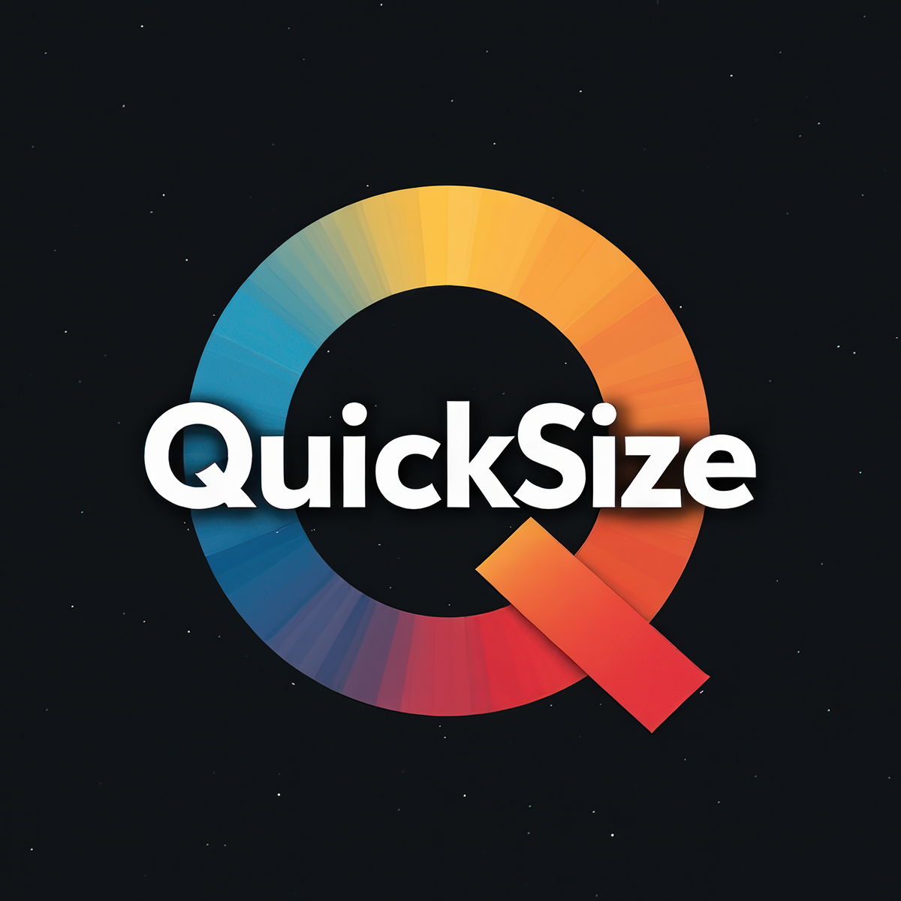
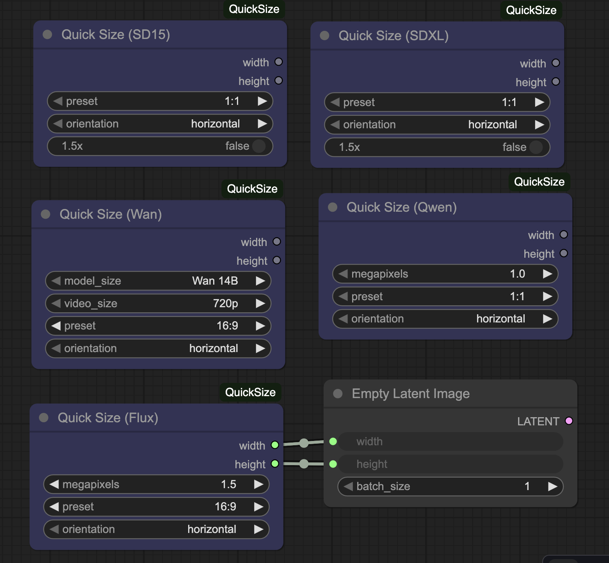

# QuickSize for ComfyUI



**QuickSize** provides easy-to-use dropdown selectors for common image resolutions across multiple diffusion models in [ComfyUI](https://comfy.org/).  
Each node outputs `width` and `height` integers based on a predefined aspect ratio, megapixel tier (or multiplier), and orientation (horizontal or vertical). No more keeping track of native image dimensions for different models.

---

## ✨ Features

- 🧩 Nodes for **Flux**, **Qwen**, **Wan**, **SDXL**, and **SD1.5** native dimensions  
- 🖼️ Aspect ratio selector (1:1, 2:3, 4:3, 16:9, 21:9, etc.)  
- 📏 Megapixel presets (1.0 MP, 1.5 MP, 2.0 MP) or multiplier options (e.g. 1.5×)  
- 🔄 Orientation switch — flip between vertical or horizontal  
- ⚡ Clean integer outputs ready for **Empty Latent Image** or any node requiring `width`/`height`

---



---

## 📦 Installation

### Option 1 — Manual
1. Navigate to your ComfyUI installation directory.  
2. Clone this repository inside `ComfyUI/custom_nodes/`:
```
   cd ComfyUI/custom_nodes  
   git clone https://github.com/rh6423/ComfyUI-QuickSize.git
```
3. Restart ComfyUI.

### Option 2 — ComfyUI Manager
Search for **“QuickSize”** in the ComfyUI Node Registry and click **Install**.

---

## 🧠 Usage

1. Add one of the QuickSize nodes (e.g., **QuickSize (Flux)**).  
2. Choose:
   - **Megapixels / Multiplier** — overall output scale  
   - **Aspect Ratio** — 1:1, 2:3, 4:3, 16:9, 21:9  
   - **Orientation** — horizontal / vertical  
3. Connect the `width` and `height` outputs to any node that accepts image dimensions.

Each model-specific node is tuned to its model’s recommended resolution ranges.

---

## 🧩 Included Nodes

| Node Name | Purpose |
|------------|----------|
| **QuickSize (Flux)** | Presets for the Flux model |
| **QuickSize (Qwen)** | Presets for Qwen image model |
| **QuickSize (Wan)** | Presets for the Wan model |
| **QuickSize (SDXL)** | Presets for Stable Diffusion XL |
| **QuickSize (SD1.5)** | Presets for Stable Diffusion 1.5 |

*(Add or remove rows as your repository evolves.)*

---

## 🧰 Size presets

Each node is implemented as an individual Python file under:

src/quicksize/

The pixel resolutions are inside each node's .py file. More user friendly resolution lists are in the backlog right now.

---

## ⚖️ License

This project is licensed under the **GNU General Public License v3.0**.  
See the [LICENSE](LICENSE) file for details.

---

## 🧾 Metadata

- **Author / Publisher:** [rh6423](https://github.com/rh6423)  
- **Repository:** [https://github.com/rh6423/ComfyUI-QuickSize](https://github.com/rh6423/ComfyUI-QuickSize)  
- **Publisher ID (Registry):** `rh6423`  
- **Compatible with:** ComfyUI ≥ 1.0  

---

## 🙌 Contributing

Contributions and new model presets are welcome!  
If you’d like to add a model, please open an issue describing:
- Model name  
- Recommended base resolutions  
- Any special scaling or megapixel logic  

---

*QuickSize — effortless image sizing for every diffusion model.*
